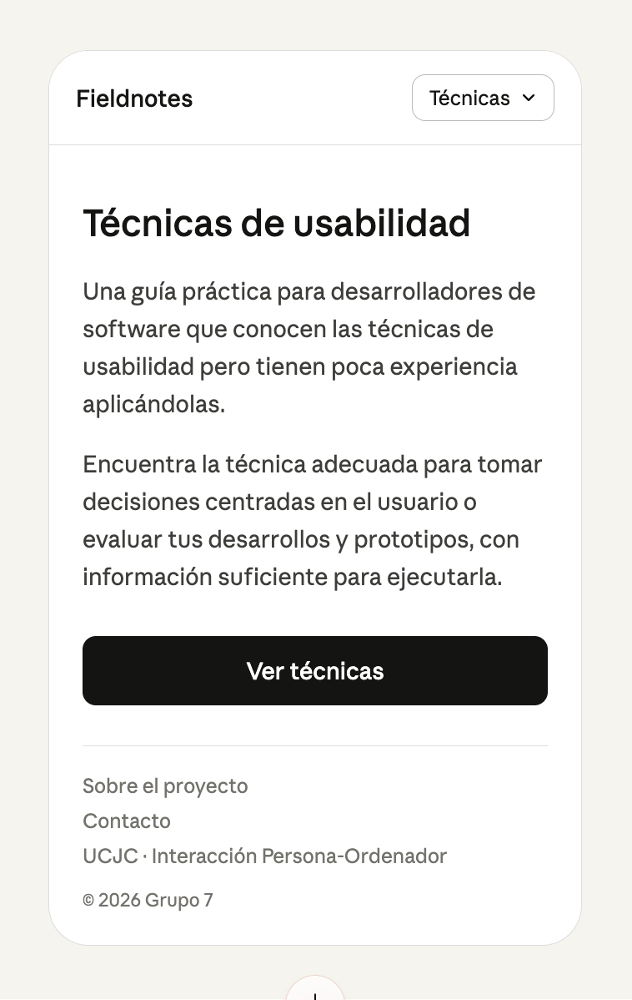
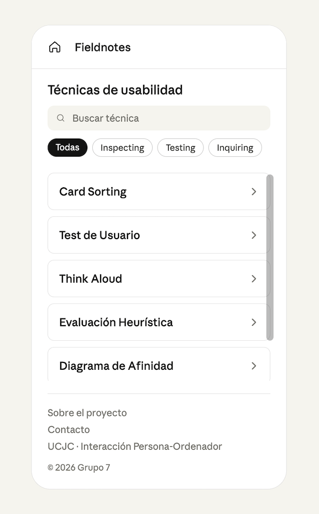
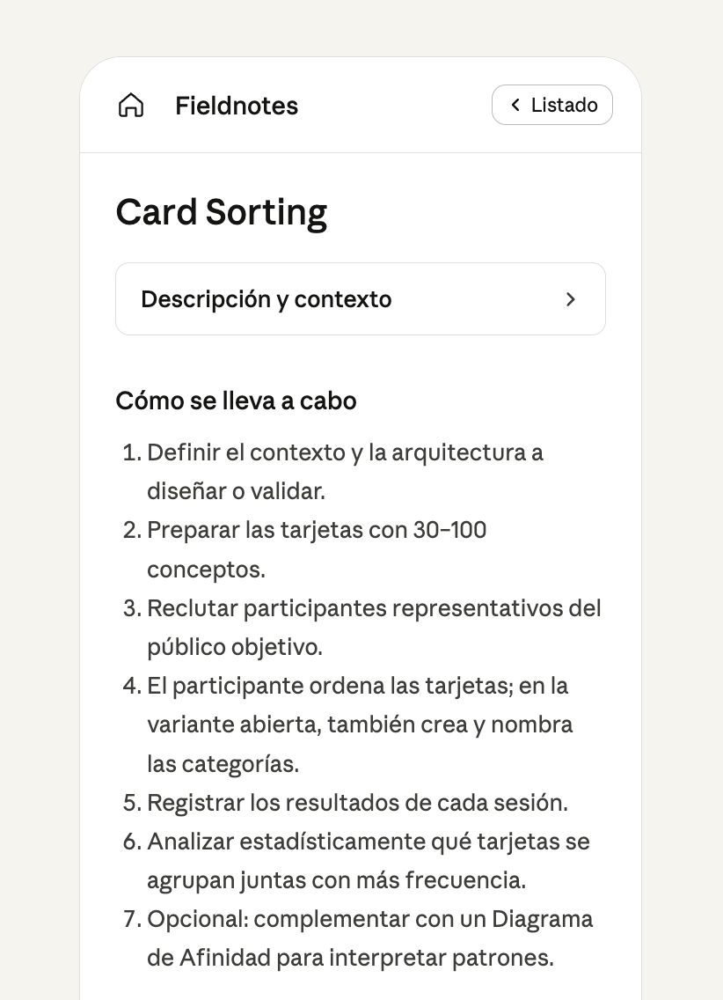
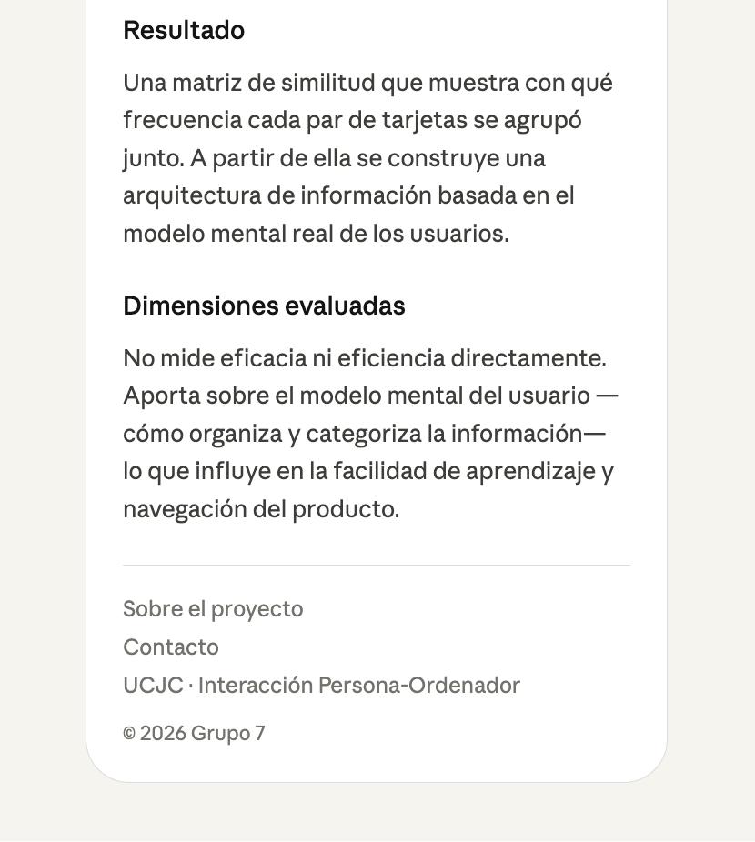
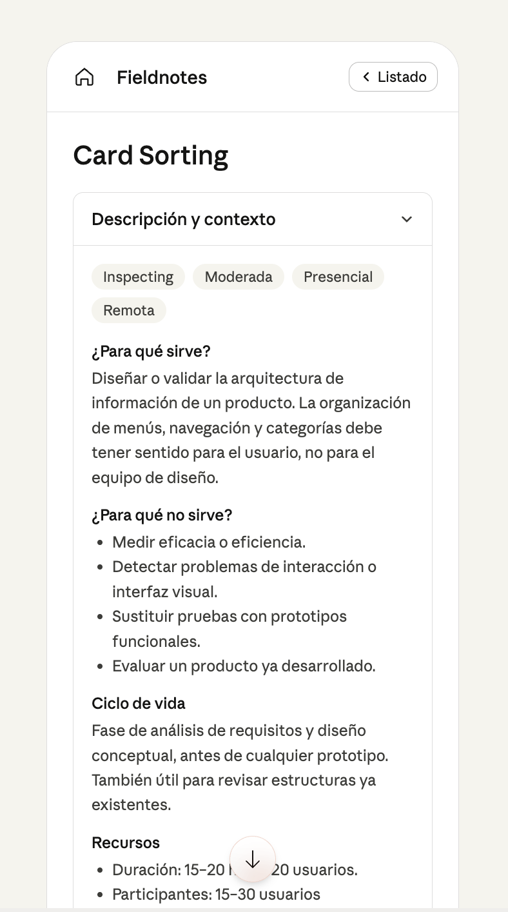
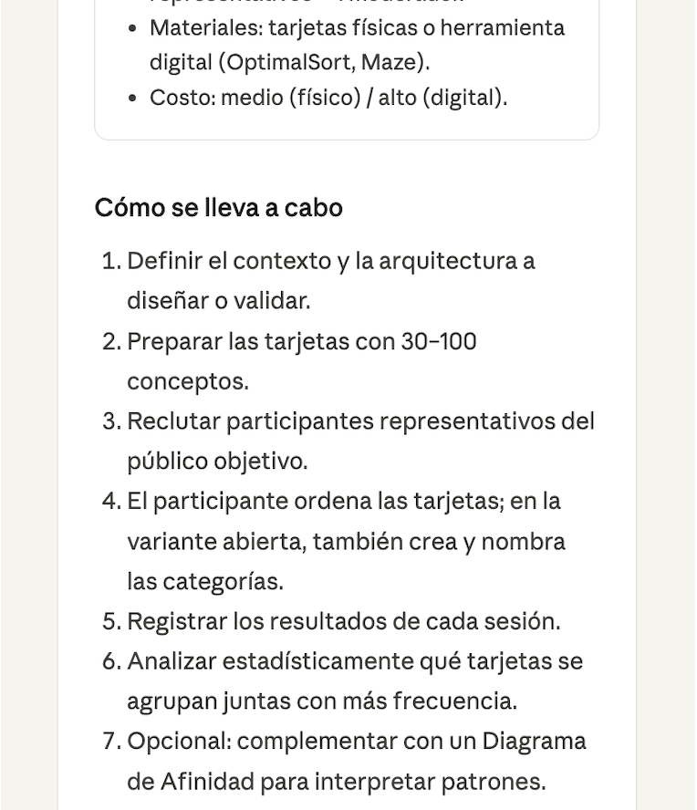
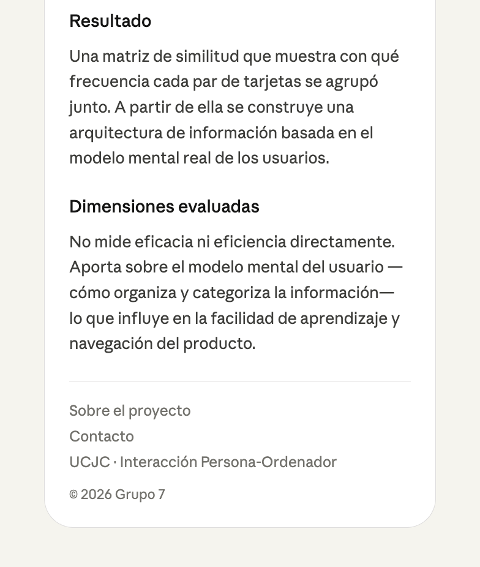

# Fase 0 - Preparación antes de tocar código
## Alcance
### Lista de Técnicas a Incluir en la Web
- Card Sorting
- Test de Usuario
- Think Aloud
- Evaluación Heurística
- Diagrama de Afinidad
- Cuestionario SUS

### Criterios de éxito del proyecto
- Buena documentación de las decisiones de diseño tomadas -> crear otra ficha para esto?
- Contexto de uso -> Mobile-first (como en RSW) para que se pueda usar en el celular y en la computadora

### Implementación a futuro
- Login/register
- Guardar técnicas específicas en la cuenta de cada usuario
- Hacer notas como usuario sobre las técnicas (ejecución, cambios, etc.) y crear propias técnicas

## Arquitectura
Qué secciones tendrá la web y cómo se relacionan. Pensar en los dos contextos del enunciado (oficina vs. móvil en plena prueba).

### Secciones
1. Home: Incluye una breve descripción del fin de la página, y un botón que lleve al listado de técnicas
2. Listado: Listado/tabla de técnicas con filtros
3. Detalles: Vista detallada de la técnica seleccionada

## Wireframes
### Mobile
#### Home


Elementos: 
- Header que contiene el nombre de la web y un dropdown a tipos de técnicas (Inspecting/Testing/Inquiring)
- Título (Técnicas de Usabilidad)
- Breve descripción de lo que hace la web
- Botón que lleva a la página de técnicas de usabilidad
- Footer con detalles

#### Listado


Elementos:
- Header (Casita que lleva al inicio)
- Título (Técnicas de Usabilidad, no debería ocupar tanto espacio como en el Home, es preferible que se vean directamente las técnicas)
- Barra de búsqueda
- Tabla con filtros (chips) de las técnicas
  - Cards de técnicas:
    - Móvil: solo aparecen los nombres de las técnicas, una abajo de la otra, deberían haber mínimo 3 visibles antes de hacer scroll
    - Ordenador: podría aparecer algún detalle de clasificación además del nombre de la técnica
- Footer
#### Detalles
##### No Desplegado



##### Desplegado





Elementos:
- Header (Casita que lleva al inicio, botón que lleve a la página de listado)
- Título (Nombre de la técnica)
Desde lo siguiente hasta el "Cómo se lleva a cabo" podría ser un toggle, para que el usuario tenga facilidad de ir directamente a la ejecución de la técnica si ya sabe lo que es.
  - Clasificación (mismos chips de categoría) 
    - Inspecting/Testing/Inquiring
    - Moderada/No moderada
    - Presencial/Remota
  - Breve descripción de para qué sirve/no sirve
  - Momento del ciclo de vida del desarrollo
  - Recursos
  - Cómo se lleva a cabo
  - Resultado/Output
  - Dimensiones de usabilidad evaluadas
- Footer

### Desktop
#### Home
#### Listado
#### Detalles

## Sistema visual
Paleta, tipografía, escala de espaciado, breakpoints, componentes base (card de técnica, chip de etiqueta, botón).

### Paleta
1. Background (fondo de la página):
2. Surface (fondo de cards/paneles ligeramente "elevados" sobre `bg`): 
3. Border (divisores finos, contornos de card, separadores de filtros):
4. Text (cuerpo de texto principal): 
5. TextMuted (metadatos, etiquetas de campo, captions. Versión atenuada de text):
6. Accent (color de acción. Links, botón primario, elemento seleccionado, anillo de foco):
    > Tiene que pasar AA sobre bg (≥4.5:1 para texto, ≥3:1 para elementos grandes/UI).
7. AccentHover (variante más oscura/saturada para hover y active):

Ejemplo: 
```css
:root {
  --color-bg: #fdfdfc;
  --color-surface: #ffffff;
  --color-border: #e5e4e0;
  --color-text: #1a1a1a;
  --color-text-muted: #6b6b6b;
  --color-accent: #2f5fe0;
  --color-accent-hover: #1f45b2;
}
```

### Tipografía
1. **Opción 1:** Literata
2. **Opción 2:** PT Serif

### Escala de espaciado
Estándar

### Breakpoints
Estándar

### Componentes base
- Card de técnica
- Botón